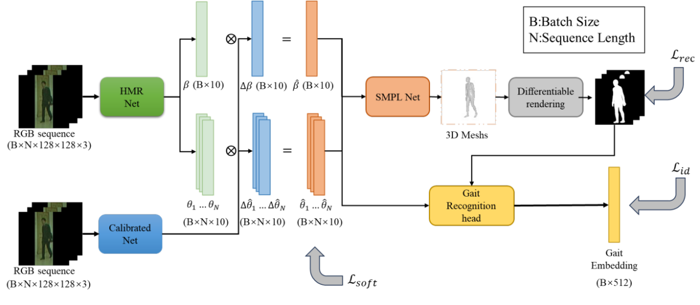
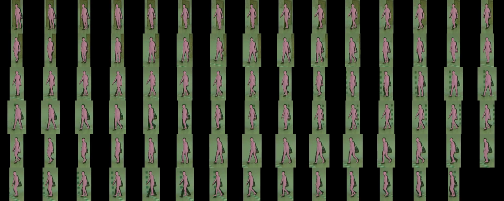
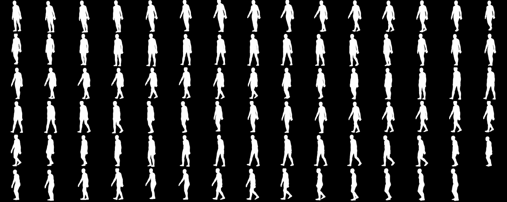
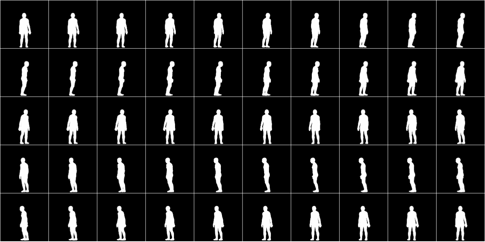

##  A  generative model with 3D human pose estimation for multi-view gait recognition

This repo contains the code of our papers:

A generative model with 3D human pose estimation for multi-view gait recognition

## Abstract

Gait recognition represents a highly prospective biometric technology with the goal of individual identification through the analysis of walking patterns. This approach presents advantages in the context of long-range identifica tion and the complexity of disguising. Most existing gait recognition methods utilize post-processed gait silhouette images, which introduce certain challenges. Firstly, the utilization of gait silhouette images is susceptible to noise during the processing phase, thereby affecting the model’s generalization performance. Secondly, gait silhouette images lack fine-grained information about the human body. To address this challenge, in this paper, we propose a new perspective that involves utilizing a human pose estimation net work to estimate the SMPL parameters of the human body.These SMPL parameters are then used for rendering silhouette images, which are subsequently employed in gait recognition. This approach aims to eliminate noise in silhouette images and remove fine-grained features unrelated to gait recognition, ultimately enhancing the generalization capability of gait recognition.

## 模型框图




## 可视化结果

渲染的图像和原图像



SMPL 渲染出的图像



渲染跟节点，旋转人体:



测试代码	


```bash
python opengait/main.py --cfgs ./configs/hybrik_smplgait/smpl_calibrate_gait.yaml --phase test
```

## 评价指标

在数据集CASIA-B的评价的代码：

```python
[2023-10-05 15:44:44] [INFO]: ===Rank-1 (Exclude identical-view cases)===
[2023-10-05 15:44:44] [INFO]: NM: [70.90 81.40 86.20 85.40 81.10 77.10 82.10 85.60 85.50 85.20 69.00]
[2023-10-05 15:44:44] [INFO]: BG: [57.80 66.60 73.90 76.70 71.40 69.90 72.00 72.80 74.80 67.20 55.00]
[2023-10-05 15:44:44] [INFO]: CL: [47.40 56.00 60.50 64.30 63.60 53.40 57.10 59.30 52.20 52.20 39.50]
[2023-10-05 15:44:44] [INFO]: NM: 80.86%	BG: 68.92%	CL: 55.05%	
```


## Evaluation

测试代码	


```bash
python opengait/main.py --cfgs ./configs/hybrik_smplgait/smpl_calibrate_gait.yaml --phase test
```

## 注意事项

由于

该代码主要修改自https://github.com/ShiqiYu/OpenGait
