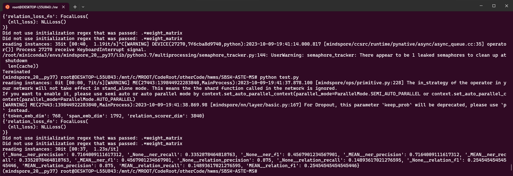

# SBSK-ASTE-MS

方面情感三元组提取任务模型
使用 mindspore 复现

TODO :
- 输入预处理以及读取
    + 数据集获取
    + 数据集预处理代码迁移
    + 展示数据集
- 模型迁移搭建（推理
    + API 缺失分析
    + 单元测试
    + 推理指标测试
- 模型训练器及优化器（推理及训练
- 优化
    + 代码裁剪
    + 算子耗时分析
    + 转换静态图训练
## 环境准备
- 安装 mindspore，以及 GPU 环境的依赖，详情见官网
- 

## 执行推理

确保文件夹 `pretrain` 下有转换好的预训练模型 `np_best.npy`，执行 `script` 下的 `cover_np_model_to_ms.py` 转换为对应的ms权重
```sh
python script/cover_np_model_to_ms.py
```

确保存在预训练的词汇表
- vocab.txt
- None__ner_labels.txt  
- None__relation_labels.txt  
- None__tag_labels.txt  
- dep_adj_labels.txt

执行推理文件
```sh
python inference.py
```

- 